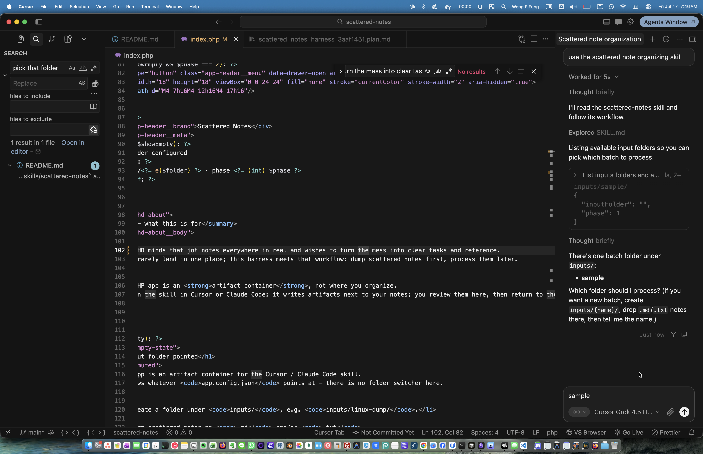
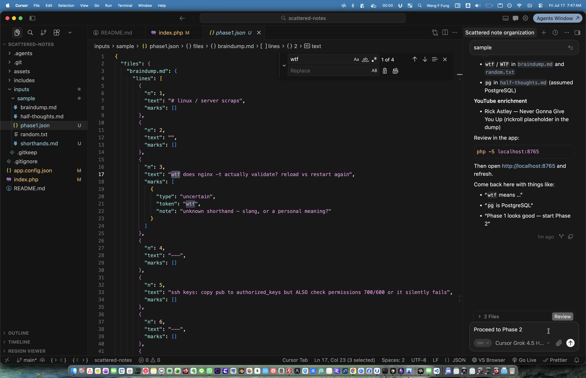
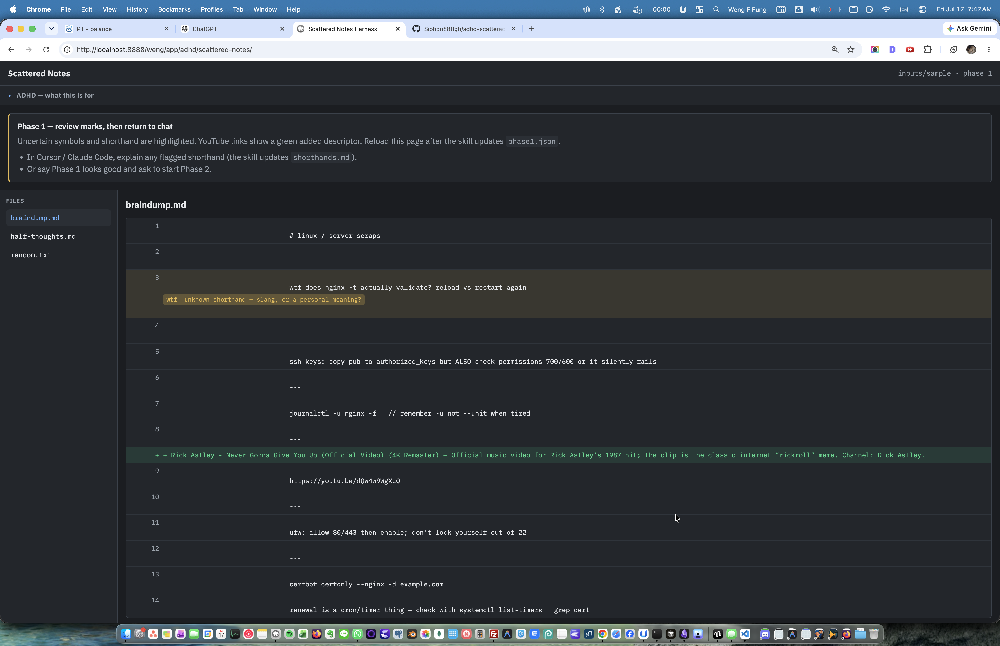
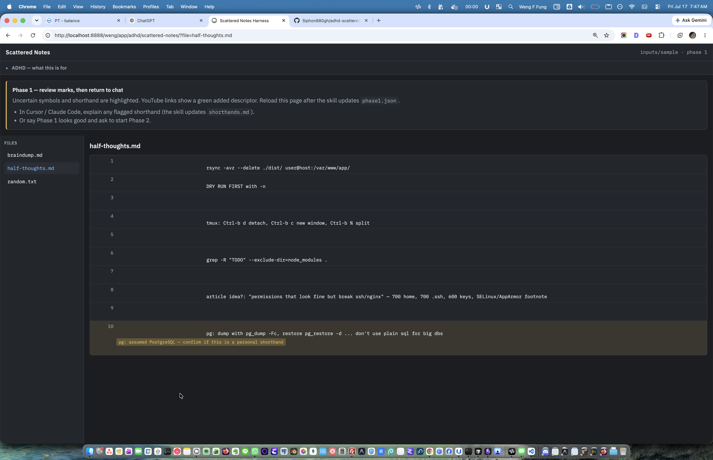
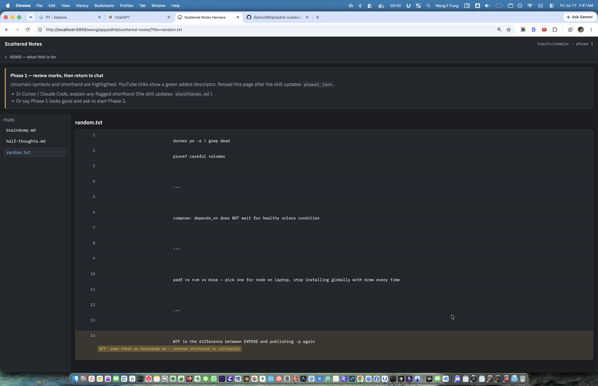
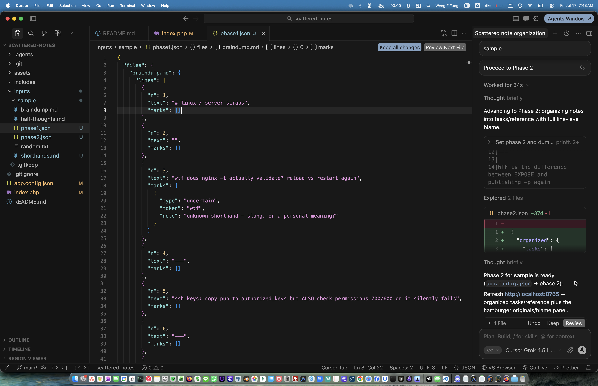
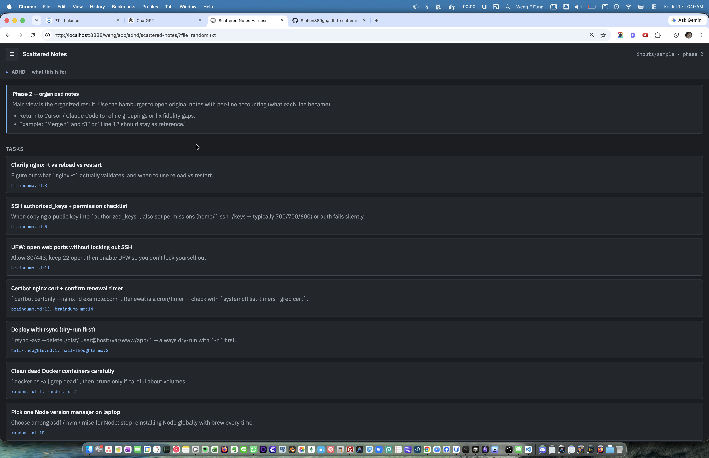
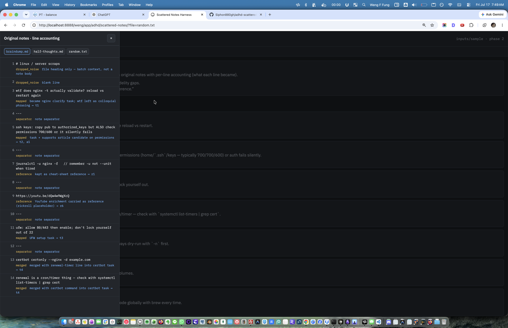

# Scattered Notes Harness for ADHD Mind

By Weng (Weng Fei Fung)

For ADHD minds that jot notes everywhere in real time-and wishes to turn the mess into clear tasks and reference.


[](https://github.com/Siphon880gh)
[](https://www.linkedin.com/in/weng-fung/)
[](https://www.youtube.com/@WayneTeachesCode/)

A Cursor / Claude Code harness for turning a folder of ad-hoc notes into grouped tasks and reference knowledge—without losing detail.

The PHP app is an **artifact container**. The skill does the heavy organizing in Cursor or Claude Code and writes artifacts next to your notes. You open `index.php` to review them, make light Phase 2 adjustments in the browser (move / tag / reorder), then return to the chat for merges and fidelity fixes.

## Why this exists for ADHD

If you have ADHD, notes rarely land in one place. You jot something in a `.txt` file, sketch an idea in a `.md` note, save a half-formed thought in another file—and weeks later you have a folder of fragments with no clear through-line.

This harness meets that workflow: dump scattered notes first, process them in two fidelity-preserving phases later.

The skill treats a note as a line, a group of lines, or a whole file, and uses `---` as the separator between notes in a file. It understands that empty lines—or just the next line—may be a separate thought entirely. It also understands the same thought may be broken across multiple files. You do not need a clean system first; dump first, AI will suggest organization later.

## Roles

| Piece | Role |
|-------|------|
| `.agents/skills/scattered-notes` | Agent skill: pick folder, write artifacts, update config |
| `app.config.json` | Points the app at one `inputs/` folder and the active phase |
| `index.php` | Phase 1 reviewer + Phase 2 interactive organizer (saves into `phase2.json`) |

There is **no folder switcher in the app**. The skill sets `app.config.json`; the app shows whatever that file points at.

## Setup

1. Create a batch folder: `inputs/whatname/`
2. Drop scattered notes as `.md` and/or `.txt`. One thought per file, many thoughts in one file, or one thought split across files—all fine. Use `---` between thoughts in the same file when you want a hard break; blank lines and adjacent lines can still be separate thoughts.
3. In Cursor or Claude Code, run the skill at `.agents/skills/scattered-notes` and pick that folder (the skill will set `app.config.json`) — **or** prompt to use the scattered note organizing skill.
4. Serve the app and open it to review artifacts:

```bash
php -S localhost:8765
```

Then open `http://localhost:8765`.

## Input layout

```
shorthands.md          # app-wide glossary (skill-maintained)
app.config.json
inputs/
  whatname/
    note-one.md
    random-thought.txt
    phase1.json        # uncertain marks + YouTube descriptors
    phase2.json        # organized notes + per-line blame map
```

`app.config.json`:

```json
{
  "inputFolder": "whatname",
  "phase": 1
}
```

## Two phases

### Phase 1 — clarify before organize

The skill reads the app-wide `shorthands.md` (project root) first, then marks unclear symbols and shorthand. YouTube links get a green “added” descriptor (title / what the video is about) inferred from the video’s title, description, and comments—no watching required.

Review marks in `index.php`. Explain shorthand in the agent chat; the skill updates root `shorthands.md` and refreshes `phase1.json`. Reload the app to see updates.

### Phase 2 — organize with fidelity

When Phase 1 is done, the skill groups notes into **Scattered**, **Reference**, and **Articles** (stored in `phase2.json` as `tasks`, `reference`, and `articleCandidates`). Every source line is accounted for in a blame map so details do not disappear silently.

In the app you can:

- **Move** items between Scattered / Reference / Articles (Move dropdown on each card)
- **Tag** any item on the right; new tags appear in the **Filter** bar at the top
- **Collapse / expand** each panel from its header
- **Rearrange** items inside a panel: click the ↔ icon, drag cards, then release (or click ↔ again) to finish — order is saved
- Open original notes with per-line accounting via the hamburger (**B** toggles that sidebar open/closed)

Browser edits write back to `phase2.json`. Return to Cursor / Claude Code for merges or fidelity fixes (e.g. “Merge t1 and t3”).

## Skill handoff

Each phase in the app tells you how to return to Cursor or Claude Code to continue. Typical loop:

1. Skill writes artifacts and sets `app.config.json`
2. You review in `index.php`
3. You go back to the chat to explain marks, advance phases, or fix fidelity gaps

## Alternate workflow (slash commands)

Same harness, stepped explicitly in chat:

1. `/scattered-notes Start` — list folders under `inputs/`, pick one (or reset sample / use your own notes)
2. `/scattered-notes Lets start Phase 1` — mark uncertain shorthand/symbols and enrich YouTube links; review in `index.php`, then return to chat to explain marks or confirm
3. `/scattered-notes Lets go to Phase 2` — organize into Scattered / Reference / Articles with per-line blame; review and lightly edit in `index.php`, then return to chat to refine

Between steps, serve and open the app as usual (`php -S localhost:8765` → `http://localhost:8765`).

## Who this is for

Anyone who captures thoughts in bursts and organizes later—or never quite gets to the organizing part. The harness meets you where your notes already are.

## How it looks / how to use

### 1. Run the skill and pick a folder

In Cursor or Claude Code, ask to use the scattered-notes skill. The agent lists folders under `inputs/` and waits for you to pick one (here: `sample`).



### 2. Phase 1 artifacts land in the batch folder

The skill writes `phase1.json` (uncertain marks, YouTube descriptors) and points you at the PHP app to review—or you can tell it Phase 1 looks good and to continue.



### 3. Review Phase 1 in the app — uncertain marks and YouTube adds

Open `index.php`. Uncertain shorthand is highlighted with a note; YouTube links get a green added descriptor. Explain marks back in chat, or say Phase 1 looks good.



### 4. Flip through files — more shorthand marks

Same Phase 1 view on another note (`half-thoughts.md`): e.g. `pg` flagged for confirmation.



### 5. Cross-file marks

Marks can repeat across files (e.g. `WTF` in `random.txt` linked to the same token in `braindump.md`).



### 6. Advance to Phase 2 in chat

Back in the agent chat, ask to proceed to Phase 2. The skill writes `phase2.json` and sets `app.config.json` to phase 2.



### 7. Phase 2 — organized panels you can edit

Reload the app. The main view shows **Scattered**, **Reference**, and **Articles** with source line links. On each card, use the right-side tray to add tags and Move between panels. Use the top Filter chips once tags exist; collapse panels from the header; use ↔ to rearrange within a panel.



### 8. Hamburger — original notes with per-line accounting

Use the hamburger (or **B**) to open or close original notes. Each source line shows what it became (`mapped`, `merged`, `reference`, `dropped_noise`, etc.) so nothing disappears silently.


